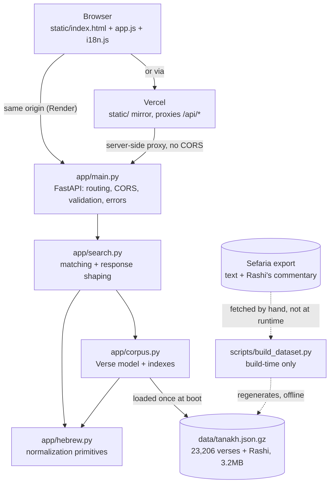
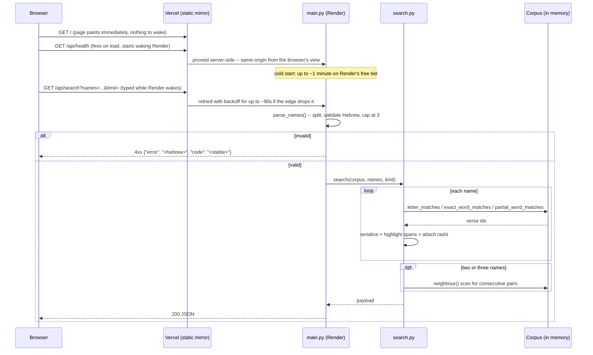

# High-level design — אות ואות

What the system is, why it is shaped this way, and how a request flows through
it. Per-function detail is in [`LLD.md`](LLD.md); the file-by-file map is in
[`STRUCTURE.md`](STRUCTURE.md).

## Requirements

**Functional.** Given a Hebrew name, find Tanakh verses that match it three
ways: by *letters* (the verse opens with the name's first letter and closes
with its last — the custom recited at the end of the Amidah), by
*containment* (the name appears as a word in the verse, exact or with an
attached prefix), and, for two or three names, by *pairs* of consecutive
verses each matching one name. Every result carries highlight spans, a
citation in Hebrew gematira, and — where Rashi commented on that verse — his
commentary, pre-cleaned to safe HTML.

**Non-functional.**

- *No runtime network access.* The corpus (text + Rashi) ships in the
  repository, so the service has no upstream to be slow, rate-limit, or go
  down.
- *Cold start pays once.* Loading and indexing ~23k verses takes roughly
  1.5s; that runs at boot rather than landing on the first user to search.
- *Installable, not offline.* The PWA shell (`static/manifest.json`,
  `static/sw.js`) lets a phone add it to the home screen and paints
  instantly from the cached shell, but every search is still a live API
  call — there is no offline corpus on the client.
- *A CDN has nothing to wake.* The same `static/` directory is deployed
  twice (Render, alongside the API, and Vercel, standalone) specifically so
  the page paints immediately on a cold Render instance instead of showing
  a blank screen for up to a minute. See **Dynamic view**.

## Static view

The dotted edges are deliberate: `build_dataset.py` is run by a maintainer
to regenerate the corpus and is never invoked by the service. Nothing in the
request path reaches the network.

Module boundaries run one way — `main` → `search` → `corpus` → `hebrew` —
and nothing calls back upward. `hebrew.py` is pure string manipulation with
no knowledge of verses or HTTP.

## Dynamic view

Matching never scans the corpus linearly for the common cases:
`Corpus.__init__` builds `by_letter_pair` (first letter, last letter) →
verse ids and `by_word` (normalized word) → verse ids, so letter and
exact-word lookups are dict hits. Pair search is the exception and does walk
the verse list.

The Render-cold-start problem is why the frontend is deployed twice rather
than once: served only from Render, the *page itself* would wait on the
wake, showing a blank screen. Served from Vercel, the page paints while its
own first API call starts Render waking in the background — the visitor
reads the page and types a name during the wait rather than staring at
nothing.

## Data storage

There is no database, cache, or blob store. The single store is
`data/tanakh.json.gz` (~3.2 MB, text plus Rashi's commentary), decompressed
and indexed into process memory at startup by `load_corpus()`, cached to one
entry so every request shares one instance.

The data is immutable and versioned by the `source`/`version`/`license`
fields inside the file itself, reported by `/api/health`. Backup and DR are
therefore the git repository: the corpus is a tracked artifact, and
recovering the service is redeploying the image.

## Configuration and secrets

The service takes no configuration beyond `$PORT` (supplied by the
platform) and `ALLOWED_ORIGINS` (the CORS allowlist for the Vercel-proxied
path — a plain list of hostnames, not a secret). It holds no credentials:
there is no database, no third-party API key, nothing to rotate. If that
ever changes, the rule to keep is the standard one: fail fast at startup on
a missing value rather than defaulting a secret.

## Validation at the edge

All request validation happens in `main.py` before any search runs, and
every rejection carries a stable machine-readable `code` alongside a Hebrew
message, because the frontend keys its translated error text off that code:

| Condition | Code |
| --- | --- |
| Empty or whitespace-only names | `empty` |
| No Hebrew letters in a name | `invalid_name` |
| More than `MAX_NAMES` (3) | `too_many` |
| No matching verse for `/api/random` | `not_found` |

`limit` is constrained by FastAPI's `Query(ge=1, le=MAX_LIMIT)` at the
boundary and clamped again inside `search()`, so a caller reaching the
function directly cannot exceed the cap either.

## Testing strategy

91 tests cover 97% of `app/`, split by boundary rather than by layer:

- `tests/test_hebrew.py` exercises the normalization primitives directly.
- `tests/test_search.py` covers the corpus and matching logic, and drives
  the HTTP surface through FastAPI's `TestClient`, including the cleaned-text
  regressions (parasha markers, ketiv/qere, the Rashi chapter-alignment
  fallback).
- `tests/test_build_dataset.py` covers `clean_verse()` and
  `clean_rashi_comment()` directly against the editorial-apparatus cases
  documented in the README, without needing the real Sefaria export.

Nothing mocks the corpus: the real ~23k-verse dataset loads once per
session, so the integration boundary that actually matters — matching
against real text — is tested rather than faked. CI enforces a 95% floor,
set just under the measured figure so it ratchets rather than fails on
arrival.
