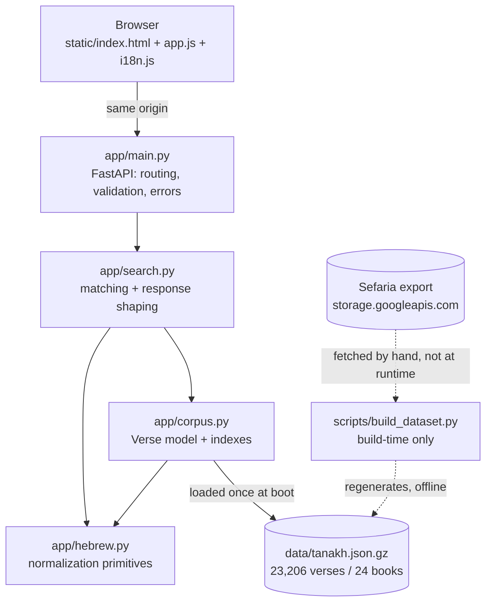
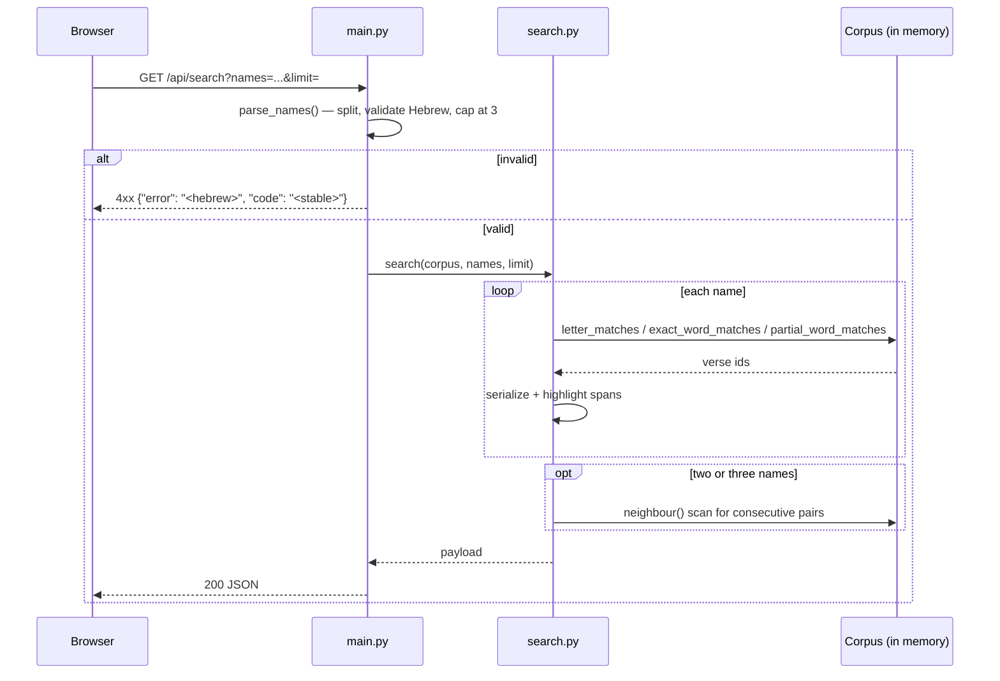

# High-level design — פסוק לשם

What the system is, why it is shaped this way, and how a request flows through
it. Per-function detail is in [`LLD.md`](LLD.md); the file-by-file map is in
[`STRUCTURE.md`](STRUCTURE.md).

## Requirements

**Functional.** Given a Hebrew personal name, find Tanakh verses that match it
three ways: by *letters* (the verse begins with the name's first letter and ends
with its last — the custom recited at the end of the Amidah), by *containment*
(the name appears as a word in the verse), and, for two or three names, by
*pairs* of consecutive verses matching two names in order. Results carry
highlight spans so the client can mark the matching letters, and book names in
Hebrew, English and French so one response serves any locale.

**Non-functional.**

- *No runtime network access.* The corpus ships in the repository, so the
  service has no upstream to be slow, rate-limit, or go down.
- *Same-origin UI.* The API and the static frontend are served by one process,
  which removes CORS configuration entirely.
- *Cold start pays once.* Loading and indexing ~23k verses takes roughly 1.5s;
  that runs at boot rather than landing on the first user to search.
- *Mobile-first, no build step.* The frontend is hand-written HTML/CSS/JS, so
  there is no bundler, no `node_modules`, and nothing to compile before deploy.

## Static view

The dotted edges are deliberate: `build_dataset.py` is run by a maintainer to
regenerate the corpus and is never invoked by the service. Nothing in the
request path reaches the network.

Module boundaries run one way — `main` → `search` → `corpus` → `hebrew` — and
nothing calls back upward. `hebrew.py` is pure string manipulation with no
knowledge of verses or HTTP, which is why its 95 statements carry the densest
tests in the repo.

## Dynamic view

Matching never scans the corpus linearly for the common cases: `Corpus.__init__`
builds `by_letter_pair` (first letter, last letter) → verse ids and `by_word`
(normalized word) → verse ids, so letter and exact-word lookups are dict hits.
Pair search is the exception and does walk the verse list, which is why it is
capped at `PAIR_LIMIT`.

## Data storage

There is no database, cache, or blob store. The single store is
`data/tanakh.json.gz` (~1.3 MB), decompressed and indexed into process memory at
startup by `load_corpus()`, which is `lru_cache`d to one entry so every request
shares one instance.

The data is immutable and versioned by the `source`/`version`/`license` fields
inside the file itself, reported by `/api/health`. Backup and DR are therefore
the git repository: the corpus is a tracked artifact, and recovering the service
is redeploying the image.

## Configuration and secrets

The service takes **no configuration and holds no secrets** — there is no
`.env.example` because there is nothing to put in one. The only external input
is `$PORT`, supplied by the platform and consumed by the `uvicorn` start command
in `render.yaml`. Nothing is read from a secret manager, so the usual
precedence question does not arise. If that ever changes, the rule to keep is
the standard one: fail fast at startup on a missing value rather than defaulting
a secret.

## Validation at the edge

All request validation happens in `main.py` before any search runs, and every
rejection carries a stable machine-readable `code` alongside a Hebrew message,
because the frontend keys its translated error text off that code:

| Condition | Code |
| --- | --- |
| Empty or whitespace-only names | `empty` |
| No Hebrew letters in a name | `invalid_name` |
| More than `MAX_NAMES` (3) | `too_many` |
| No matching verse for `/api/random` | `not_found` |

`limit` is constrained by FastAPI's `Query(ge=1, le=MAX_LIMIT)` at the boundary
and clamped again inside `search()`, so a caller reaching the function directly
cannot exceed the cap either.

## Testing strategy

77 tests cover 97% of `app/`, split by boundary rather than by layer:

- `tests/test_hebrew.py` exercises the normalization primitives directly —
  final-letter folding, mark handling, gematria, word spans.
- `tests/test_search.py` covers the corpus and matching logic, and drives the
  HTTP surface through FastAPI's `TestClient`, which exercises routing,
  validation, and the error contract end to end without a live server.

Nothing mocks the corpus: the real 23k-verse dataset loads once per session, so
the integration boundary that actually matters — matching against real text — is
tested rather than faked. CI enforces a 95% floor, set just under the measured
figure so it ratchets rather than fails on arrival.
